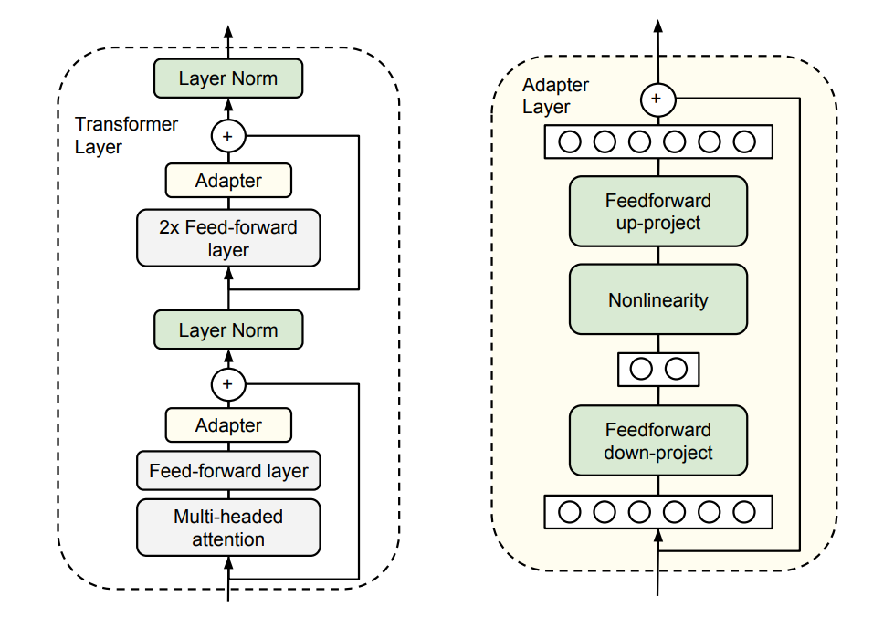

# Адаптеры (Adapters)

Адаптеры - это один из PEFT-методов, который был предложен в статье [Parameter-Efficient Transfer Learning for NLP (Houlsby et al., 2019)](https://arxiv.org/abs/1902.00751). Рассмотрим следующую постановку проблемы:

У нас есть набор задач (например, в области NLP), которые мы хотели бы научиться решать с помощью модели машинного обучения. У нас нет возможности собрать достаточное количество данных и обучить по отдельной модели с нуля на каждую из этих задач. Зато данных должно хватить для дообучения какой-нибудь очень большой предобученной модели. На этом этапе мы сталкиваемся с рядом трудностей:
* модель *большая*, полное дообучение с разморозкой всех параметров может оказаться слишком дорогим, а разморозка малого числа параметров может не дать желаемого качества;
* даже если у нас есть возможность дообучать модель, теперь нам необходимо хранить по одной версии этой *большой* модели на каждую из задач, что может быть неудобно и дорого;

Адаптеры предлагают подход к решению этих проблем. Вместо дообучения весов модели, предлагается обучать небольшие модули, которые размещались бы после каких-нибудь слоев и изменяли бы их выходы. 

В статье адаптеры применяют для дообучения BERT'а на 26 разных задач. В ней адаптеры имеют форму ботлнек-слоя с функцией активации посередине и skip connection'ом. Располагаются они после каждого полносвязного слоя в сети. Суммарный размер всех адаптеров для одной задачи составил порядка ~1-3% от размера всей модели.

По итогу получилось, что качество модели с адаптерами сопоставимо с качеством полностью дообученной модели. Немного увеличилось время инференса, но зато выше перечисленных проблем теперь можно избежать:
* адаптеры *маленькие*, обучать их не так дорого как всю модель;
* для хранения разных версий модели теперь не надо много места.

В качестве приятного бонуса: можно организовать инференс так, чтобы одновременно обрабатывать батч, состоящий из запросов по разным задачам - одновременно работать с несколькими версиями адаптеров не так страшно, как с несколькими версиями дообученной основной модели.

Позднее появилось много разных видов адаптеров. Идеи некоторых из них мы еще разберем в рамках этой главы. Стоит отметить, что есть такой ресурс как [AdapterHub](https://adapterhub.ml/). Это репозиторий по типу Hugging Face Hub'а для трансформеров, в котором хранятся адаптеры всех сортов для всевозможных моделей и задач (а если чего-то нет, можно контрибьютить). Для него есть документация и руководства, он совместим с библиотекой [transformers](https://github.com/huggingface/transformers), ссылки будут ниже.

## Ссылки

[1] Parameter-Efficient Transfer Learning for NLP. Houlsby N, Giurgiu A, Jastrzebski S (2019)\
https://arxiv.org/abs/1902.00751

[2] AdapterHub\
https://adapterhub.ml/

[3] Руководство по AdapterHub от Hugging Face\
https://huggingface.co/docs/hub/adapter-transformers

[4] GitHub аддона с адаптерами к библиотеке transformers\
https://github.com/adapter-hub/adapters
