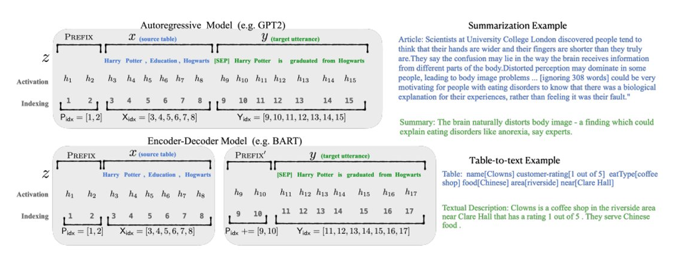

# Введение
Раньше для того, чтобы заняться глубоким обучением, вы должны были иметь доступ к большому очищенному набору данных и самостоятельно разработать и обучить эффективную модель. Значит, проекты без существенной поддержки извне были невозможны по умолчанию. Однако за последние пару лет всё изменилось. Движущая сила такого роста — трансферное обучение.

**Трансферное обучение** подразумевает использование предварительно обученной модели, разработанной для конкретной задачи, и повторное использование ее в качестве отправной точки для новой, связанной задачи. Большая языковая модель, предварительно обученная на огромных объемах данных, уже усвоила широкий спектр языковых конструкций и знаний. 

**Точная настройка** предполагает использование предварительно обученной модели и ее дальнейшее обучение новой задаче с новыми данными. Тонкой настройке обычно обучается вся предварительно обученная модель, включая все ее слои и параметры. Этот процесс может оказаться дорогостоящим и трудоемким, особенно для больших моделей.

**Точная настройка с эффективным использованием параметров** -  это метод точной настройки, который фокусируется на обучении только подмножества параметров предварительно обученной модели. Этот подход предполагает определение наиболее важных параметров для новой задачи и обновление этих параметров только во время обучения. Благодаря этому PEFT может значительно сократить объем вычислений, необходимых для точной настройки.

## Преимущества PEFT

1.  **Снижение затрат на вычисления и хранение:** PEFT включает в себя точную настройку лишь небольшого количества дополнительных параметров модели при одновременном замораживании большинства параметров предварительно обученных LLM, что значительно снижает затраты на вычисления и хранение.
2.  **Преодоление катастрофического забывания:** Во время полной настройки LLM может произойти катастрофическое забывание, когда модель забывает знания, полученные во время предварительного обучения. PEFT может решить эту проблему, обновив лишь несколько параметров.
3.  **Более высокая производительность в режимах с малым объемом данных:** Было показано, что подходы PEFT работают лучше, чем полная точная настройка в режимах с небольшим объемом данных, и лучше обобщаются на сценарии, выходящие за пределы предметной области.
4.  **Переносимость:** методы PEFT позволяют пользователям получать крошечные контрольные точки размером в несколько МБ по сравнению с большими контрольными точками
# Методы PEFT

## Prompt tuning
Первоначальная концепция prompt tuning относится к методам, которые изменяют входной промпт для достижения лучших результатов. Например, предположим, что мы хотим в перевести английское предложение на немецкий. Мы можем задать модели различные вопросы, как показано ниже:

Подход, проиллюстрированный выше, называется hard prompt tuning, поскольку мы напрямую меняем дискретные входные токены, которые не поддаются обновлению с помошью обратного распространения.

В отличие от hard prompt tuning, soft prompt tuning [Lester et al., 2021](https://arxiv.org/abs/2104.08691) объединяет ембеддинги входных токенов с обучаемым тензором, который может быть оптимизирован с помощью обратного распространения.

Soft prompts отличаются от hard prompts тем, что они обучаются путем обратного распространения и, таким образом, корректируются на основе лосса на наборе данных.

Soft prompt tuning значительно более эффективен с точки зрения параметров, чем full file tuning, хотя качество может быть немного хуже.

## Prefix tuning

Prefix tuning - это более легковесная альтернатива fine tuning больших языковых моделей [Liang 2021](https://arxiv.org/abs/2101.00190). Точная настройка требует обновления и сохранения всех параметров модели для каждой задачи, что может быть очень затратным, учитывая большой размер существующих моделей. Настройка префикса сохраняет параметры языковой модели замороженными и оптимизирует небольшой непрерывный вектор, специфичный для конкретной задачи, называемый префиксом. *Префикс* - это набор свободных параметров, которые обучаются для решения конкретной задачи.

Префикс можно рассматривать как последовательность “виртуальных токенов”, к которым могут обращаться последующие токены. Обучая только 0,1% параметров, prefix tuning обеспечивает производительность, сравнимую с full fine tuning при настройке полных данных, превосходит full fine tuning при дообучении на малом объеме данных.

*Prefix - последовательность виртуальных токенов*

Обозначим за $h_i \in \mathbb{R}^d$ вектор активаций в момент времени $i$, где $h_i = [h_i^{(1)},..,h_i^{(n)}]$ представляет собой объединение всех слоёв активации на данном временном шаге, и $h_i^{(j)}$ это вектор активации $j$ слоя в момент времени $i$.

Prefix-tuning добавляет префикс к autoregressive LM для получения $z = [Prefix;x;y]$, или добавляет префиксы для encoder и decoder: $z = [Prefix;x;Prefix';y]$.

Обозначим за $P_{\theta}$ обучаемую матрицу свободных параметров размерности $|P_{idx}| \times dim(h_i)$

 
  *При вычислении векторов активаций обрабатываем токены z по одному, если i - тый токен принадлежит префиксу, то вектор активации это i-тая строка $P_{\theta}$, иначе это вектор активаций модели после обработки $z_i$*

На практике выяснилось, что прямое обновление $P_{\theta}$ ведёт нестабильной оптимизации и падению производительности. Поэтому будем обучать матрицу меньшей размерности и с помощью полносвязной сети приводить вектора к нужному размеру. Теперь обучается P' и параметры MLP(multi layer perceptron)

$P_{theta}[i:] = MLP_{\theta}(P'_{theta}[i:])$

*NB: кол-во строк в P и P' должно совпадать*

### Рассмотрим применение prefix tuning к трансформеру.

Мы добавляем обучаемый тензор к каждому блоку трансформера (в отличие от soft prompt tuning, где обучаемый тензор добавляется только ко входным эмбеддингам). Также мы дополнительно преобразуем данный тензор с помошью полносвязной сети (двухслойный перцептрон с активацией по середине). На рисунке ниже показана разница между обычным блоком трансформера и модифицированным с помощью префикса:

При использовании prefix tuning обновляются только префиксы, в то время как остальные слои фиксируются и не обновляются.

